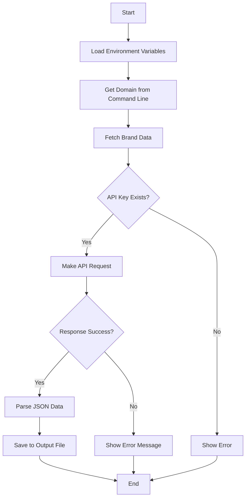

<h1 align="center"><a href="https://github.com/ronknight/get-saved-wifi-password">Get Saved WiFi Password</a></h1>
<h4 align="center">This Python script retrieves and displays the names and passwords of all saved WiFi profiles on a Windows machine.
</h4>

<p align="center">
<a href="https://twitter.com/PinoyITSolution"></a>
<a href="https://github.com/ronknight?tab=followers"></a>
<a href="https://github.com/ronknight/ronknight/stargazers"></a>
<a href="https://github.com/ronknight/ronknight/network/members"></a>
  <a href="https://youtube.com/@PinoyITSolution"></a>
<a href="https://github.com/ronknight/get-saved-wifi-password/issues"></a>
<a href="https://github.com/ronknight/get-saved-wifi-password/blob/master/LICENSE"></a>
<a href="#"></a>
<a href="https://github.com/ronknight"></a>
</p>

<p align="center">
  <a href="#requirements">📋 Requirements</a> •
  <a href="#usage">🚀 Usage</a> •
  <a href="#script">📜 Script</a> •
  <a href="#disclaimer">⚠️ Disclaimer</a> •
  <a href="#diagrams">📊 Diagrams</a>
</p>

---

## 📊 Diagrams

Here's a workflow diagram of how the Brand Search application works:



## 📋 Requirements

- Python 3.6+
- requests
- python-dotenv
- Valid Brandfetch API key

## 🚀 Usage

1. Create a `.env` file with your Brandfetch API key:
```
BRANDFETCH_API_KEY=your_api_key_here
```

2. Run the script with a domain:
```bash
python brand_fetch.py example.com
```

## 📜 Script

The script performs the following operations:
- Loads environment variables from `.env` file
- Takes a domain name as command line argument
- Fetches brand data from Brandfetch API
- Saves the response to a JSON file in the output directory

## ⚠️ Disclaimer

This script requires a valid Brandfetch API key to function. Please ensure you have the necessary API access before using the script.
